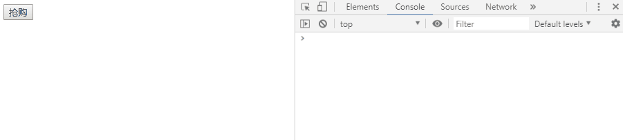
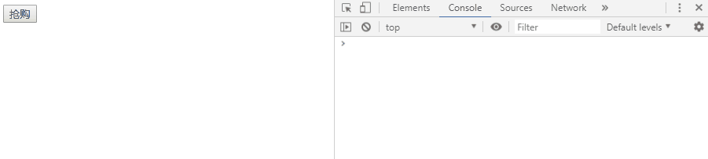
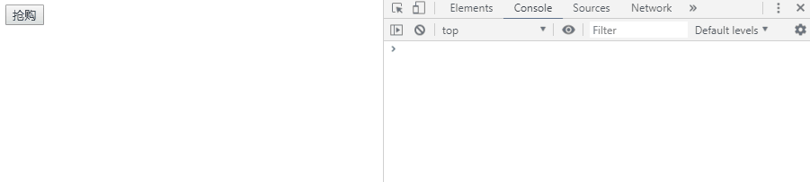

## 函数的防抖和节流
>当我们频繁的触发某些事件，或者我们需要频繁地发送请求去请求数据，我们希望的是对一些频繁触发的事件进行控制，那么就可以选择使用函数的防抖和节流进行控制。

### 防抖
* 防抖的原理
    >触发事件后在n秒内函数只能执行一次，如果在n秒内再次触发事件，那么会重新计算函数的执行事件
* 举例一个简单的场景
    >用户点击一个按钮执行一些相应的操作，不可避免用户可能存在多次快速点击，我只希望在一定时间内执行一次，那么我们使用防抖函数来实现控制用户的点击次数操作

* 先看看效果对比图
    * 防抖前
    

    * 防抖后
    
* 直接上代码
   >html部分
    ```
    <input type="button" value="抢购" id="ipt">
    ```
   >封装防抖函数
    ```
    function debounce(fn,delay=200) { 
            // 定时器标识 
            let timer = null;  
            return function () {   
            if (timer) clearTimeout(timer);    
                timer = setTimeout(() => {     
                fn.apply(this,arguments);      
                // 函数执行完就置为null,防止内存泄漏      
                timer = null   
            },delay); 
        }
    }
    ```
   >点击事件绑定
    ```
    const ipt = document.getElementById('ipt');
    ipt.onclick = function () {  
        // 为了好分别，加上时间戳
        console.log("我被点了"+Date.now())
    }
    ```
* 适用的场景
    * scroll、mousemove、resize等频繁触发的事件
  
 ### 节流
 * 节流的原理
    >指连续触发事件但是在n秒中只执行一次函数（j即使不停止操作，也会按固定时间间隔执行）
* 直接上代码
    >封装节流函数
    ```
    function throttle(fn,delay=200) {  
        let timer = null;  
        return function () {    
            if (timer) return;    
            timer = setTimeout(() => {      
                fn.apply(this,arguments);     
                clearTimeout(timer);      
                timer = null    
                },delay) 
            }
        }
    ```
    >查看效果
    
    
    
* 适用的场景
    * 比如搜索框搜索内容的时候，减少向后台请求次数，达到性能的优化
    
    